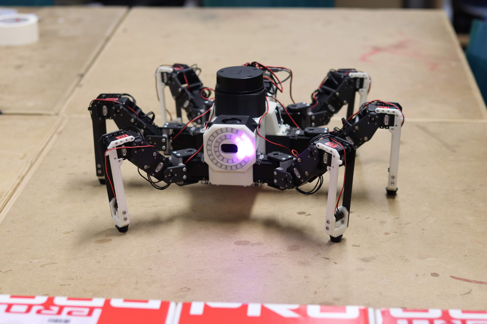
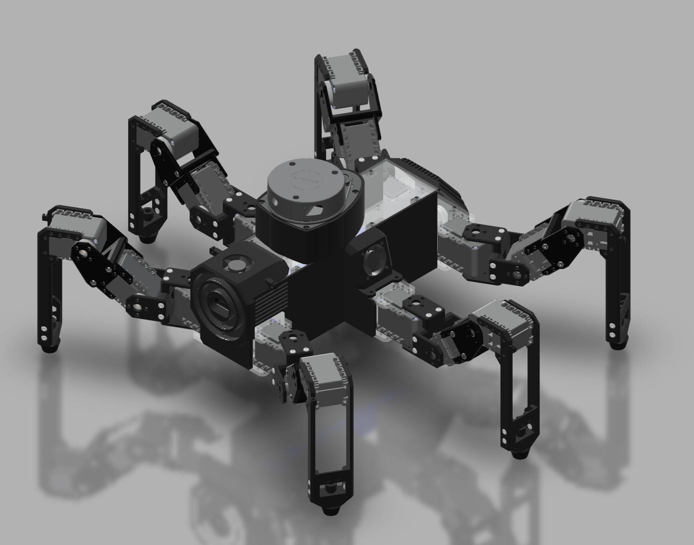

# ROS stack for a hexapod robot

## [Click here for more images](https://davidweis.dev/robotics/2019/09/21/HopperGallery2019.html)  

  

## [Click here to see live CAD model!](https://davidweis.dev/robotics/2019/06/22/HopperModels.html)  

  

## [Click here for videos](https://www.youtube.com/playlist?list=PL2rJqSX7Z5cFj5UM5ozf1wcm_McQg75ch)  

  

Hopper (Named after Grace Hopper) is a 3D printed hexapod robot running on ROS.
It's brain is a Raspberry Pi 3 running Ubunut Xenial with ROS Kinetic.
The platform is modeled and 3D printed by me and is still a work in progress. It's heavily inspired by [PhantomX Hexapod from Trossen robotics](http://www.trossenrobotics.com/phantomx-ax-hexapod.aspx)  

CAD design files can be found [here](https://github.com/dmweis/hopper_design)  
They may be outdated. If you'd like current file you can email me [here](mailto:dweis7@gmail.com)  
